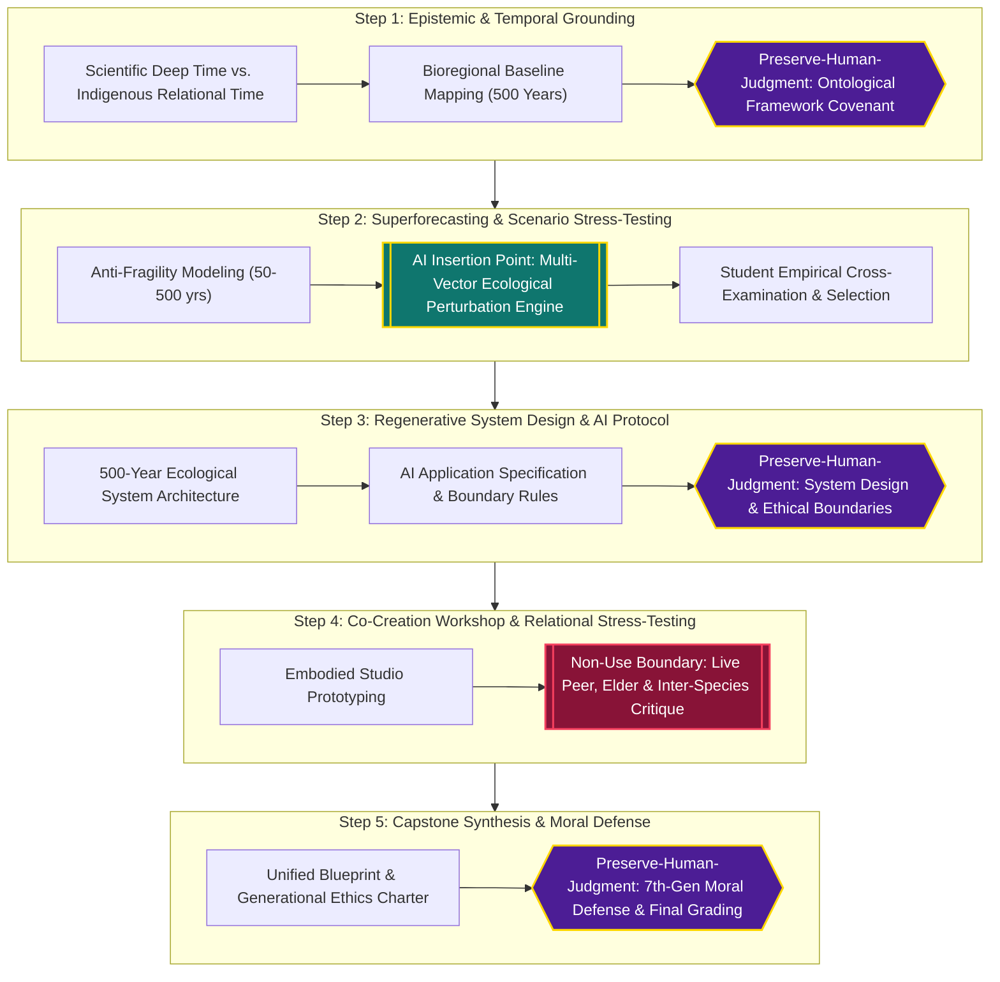

# Course Map Template (Milestone 1)
**Updated:** September 17, 2026  
**Course:** SUST 720: Designing in Deep Time (SCAD Graduate Design for Sustainability)  
**Team Name:** Chrono-Relational Studio (Team 04)  
**Course Activity Being Mapped:** *Developing a 500-Year Anti-Fragile Ecological System & Generational Ethics Charter*  
**Core Deliverable:** *The Deep-Time Anti-Fragility Blueprint & Generational Ethics Charter*  
**Bounded Question:** *How might SCAD graduate sustainable design students use algorithmic superforecasting and ecological perturbation modeling during multi-century scenario planning to design anti-fragile regenerative systems, while embedding a binding Generational Ethics Charter that prevents algorithmic substitution and protects Indigenous epistemic sovereignty?*

> ### 🎯 Learning Goal (Sits at the Top)
> **Students construct a 500-year anti-fragile regenerative ecological system blueprint and defend a generational ethics charter across seven generations.**  
> *(Observable, testable action sentence meeting Element 1 of 8).*

---

## 1. Visual Course Map: The 5-Step Sequence

---

## 2. Course Activity Step-by-Step Breakdown

| Step | Learning Goal | Activity | Assessment or Output | Student Role | Faculty Role | Decision Point & Decision Maker | Evidence or Feedback |
| :--- | :--- | :--- | :--- | :--- | :--- | :--- | :--- |
| **1** | Understand deep time, geological scales, and Indigenous relational temporalities. | Epistemic & Temporal Grounding: Exploring scientific vs. Indigenous temporal frameworks. Mapping 500-year ecological cycles using analog canvases and primary scholarly texts (Kimmerer, Whyte, Bjornerud). | **Output 1:** 500-Year Bioregional Baseline Canvas & Ontological Covenant. | Ground research in non-extractive scholarship; define ecological keystones. | Socratic facilitation; critique linear progress assumptions. | **Decision:** Selecting the bioregional baseline & core ontological framework. **Decider: Student Team** | Formative critique on cultural humility and epistemic integrity. |
| **2** | Apply superforecasting and anti-fragility to complex socio-ecological systems. | Superforecasting & Scenario Stress-Testing: Modeling system anti-fragility under compounding 500-year climate shocks (salinity inversion, permafrost thaw, biome migration lag). | **Output 2:** 4-Quadrant Volatility Matrix & Anti-Fragility Stress-Test Log. | Formulate resilience hypotheses; probe cascading failure modes. | Introduce scenario frameworks (Kahane, Dator); audit climate perturbation realism. | **Decision:** Selecting the non-linear biophysical shock to model. **Deciders: Student Team with Faculty** | Peer review; validation against empirical climate data (IPCC AR6). |
| **3** | Design regenerative system architectures and define AI application boundaries. | Regenerative System Design & AI Governance: Specifying the physical/systemic design intervention across 5 centuries, defining how AI is applied and where it is strictly bounded. | **Output 3:** 500-Year Regenerative System Architecture & AI Governance Specification. | Author original system architecture; define the Assistance Line and Non-Use boundaries. | Critique systemic coherence; verify that AI is confined to assistance and not substitution. | **Decision:** Setting the system architecture and AI ethical limits. **Decider: Student Team** | Studio critique on system viability, circularity, and ethical rigor. |
| **4** | Test assumptions through co-creation workshops and rapid prototyping. | Co-Creation Workshop & Relational Stress-Testing: Physical prototyping and live multi-stakeholder workshop testing temporal empathy, social equity, and community durability. | **Output 4:** Physical Prototype Exhibition + Multi-Stakeholder Feedback Ledger. | Present prototype; facilitate peer dialogue; defend system choices under audience scrutiny. | Moderate cross-team critique; evaluate design craft and relational empathy. | **Decision:** Validating system resilience and inter-species equity. **Decider: Peer Cohort & External Jurors** | Structured feedback cards scoring Anti-Fragility, Empathy, and Systemic Depth. |
| **5** | Synthesize cultural, scientific, and moral perspectives into one capstone deliverable. | Master Synthesis & Seventh-Generation Moral Defense: Finalizing the unified Blueprint and defending its intergenerational stewardship covenant across 7 generations. | **Output 5 (The Capstone Deliverable):** *The Deep-Time Anti-Fragility Blueprint & Generational Ethics Charter*. | Defend ethical footprint; sign the 7th-generation accountability covenant. | Final evaluative grading against SCAD graduate rubric; assess deep-time mastery. | **Decision:** Final project certification and grading. **Decider: SCAD Course Faculty** | Summative rubric: Epistemic Rigor, Anti-Fragility, Systemic Craft, and Moral Duty. |

---

## 3. Mark the Boundaries on the Map

| Marker | Location in Activity | Person Responsible | Reason | Evidence, Assumption, or Proposed Test |
| :--- | :--- | :--- | :--- | :--- |
| **🟡 AI Insertion Point** | **Step 2 (Superforecasting & Volatility Modeling):** Generating non-linear ecological shocks across Year +50 to +500. | Student Team Research Lead | Human cognitive working memory cannot compute 5th-order non-linear biophysical feedback loops. AI expands combinatorial stress-testing. | **[Assumption/Test]** Students must cross-verify generated shocks against 2 empirical climate studies before adoption. |
| **🔴 Non-Use Boundary** | **Step 1 (Epistemic Grounding):** Zero AI use on Indigenous sacred knowledge, oral traditions, or ceremonial cosmologies. | Entire Cohort & Faculty | Living Indigenous epistemologies are sacred. Algorithmic extraction flattens living knowledge and violates CARE/OCAP data sovereignty. | **[Evidence]** Lewis et al. (2020) Indigenous Protocol and AI; Kukutai & Taylor (2016). |
| **🔴 Non-Use Boundary** | **Step 4 (Co-Creation Workshops):** AI prohibited from replacing live human, community, and peer deliberation. | Peer Cohort & Guest Jurors | Relational empathy, moral vulnerability, and co-creation depend on embodied human connection. | **[Evidence]** Automated critique systems induce passive compliance and destroy studio debate (Selwyn 2023). |
| **🟣 Preserve-Human-Judgment Zone** | **Step 1, Step 3, and Step 5:** Worldview choice, System Architecture, and Seventh-Generation Moral Defense. | Graduate Students & Course Faculty | Moral intentionality, ethical stewardship, and accountability to future generations cannot be outsourced to statistical models. | **[Evidence]** Algorithmic delegation causes severe moral and systemic deskilling (Cummings 2017). |

---

## 4. Make the Risk Visible

* **Documented Concern:** **Epistemic Flattening & Algorithmic Complacency:** Students relying on AI default to conventional techno-managerial solutions (e.g., carbon capture drones, biodomes) rather than radical regenerative and relational systems.
* **Possible Benefit:** **Deep-Time Anti-Fragility Stress-Testing:** Uncovering hidden multi-variable tipping points across centuries, forcing students to engineer truly anti-fragile circular systems.
* **Preliminary Safeguard:** **The Epistemic Provenance Gate & Tri-Vector Friction Rule:** Faculty must sign off on the analog baseline before AI access; AI must generate 3 contradictory vectors requiring written student defense.
* **Unresolved Question to Test:** Does algorithmic volatility modeling enhance students' capacity to design for deep-time anti-fragility, or does it tether their thinking to historical training data distributions?

---

## 5. Peer Trace Test Report

**Conducted By:** Team 02 (Bio-Regional Futures Studio) | **Date:** September 17, 2026  
* **Criterion 1 (Sequence):** Followed clearly from baseline to final charter defense.
* **Criterion 2 (Roles):** Identified students as system designers, faculty as evaluative arbiters.
* **Criterion 3 (AI Insertion):** Located exclusively at Step 2 volatility stress-testing.
* **Criterion 4 (Non-Use):** Located at Step 1 (Sacred Knowledge) and Step 4 (Co-Creation).
* **Criterion 5 (Human Judgment):** Located at Steps 1, 3, and 5.
* **Post-Trace Structural Revision:** Confined AI strictly to modeling external biophysical stressors in Step 2; all regenerative system architecture and social responses were moved into a Preserve-Human-Judgment Zone in Step 3.
